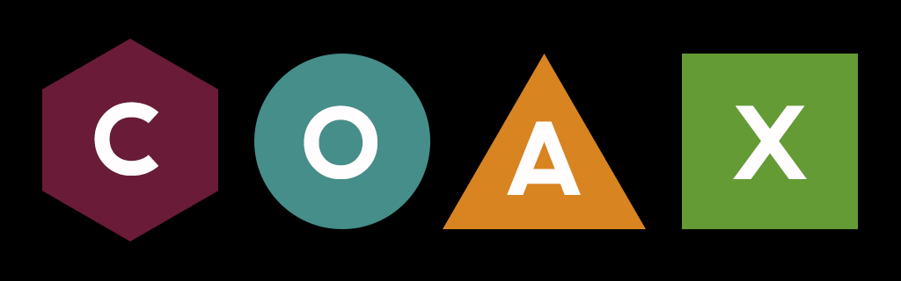
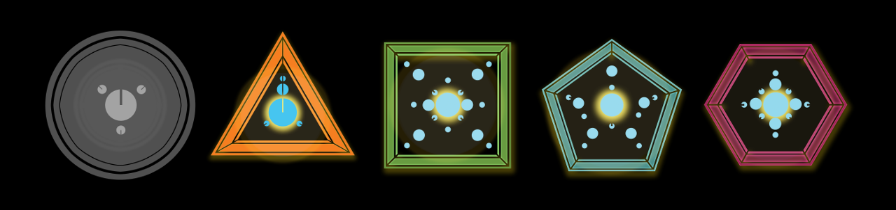
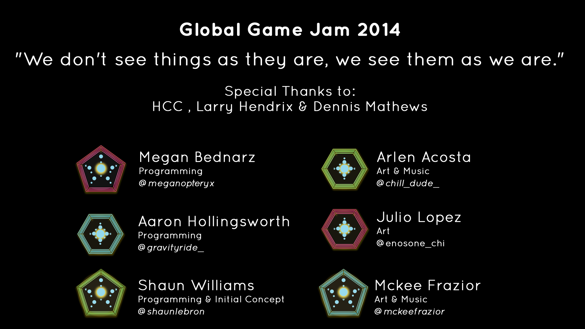

Coax
====

Built in 48 hours for the [Global Game Jam 2014 at Houston](http://globalgamejam.org/2014/games/coax).

Coax is an audio-visual experience. Navigate the space and interact with
others. Coax them into showing their true form. 

- [PLAY HERE](https://dl.dropboxusercontent.com/u/2334881/CoaxWeb/WebPlayer.html)
- [Watch Video](http://www.youtube.com/watch?v=frcOn1aVcYs)
- [Global Game Jam Page](http://globalgamejam.org/2014/games/coax)

## Instructions: 

- Move with WASD or arrow keys
- Aim with mouse. Click the left mouse button to talk.
- Match the number of sound waves the circle sends to you to make a friend!

## Credits

- __Arlen Acosta (Art/Sound)__ - characters, chatter sound fx, etc.
- __Megan Bednarz (Programming)__ - space-wrapping, pulse signals, flocking, pulse reflection, etc.
- __Mckee Frazior (Art/Music/Sound)__ - logo, background, music, sound fx, etc.
- __Julio Lopez (Art)__ - characters, sound wave arcs, etc.
- __Aaron Hollingsworth (Programming)__ - player/cam movement, omni-pulse, bomb, parallax, glow, etc.
- __Shaun Williams (Direction/Programming)__ - conversation events, etc.

